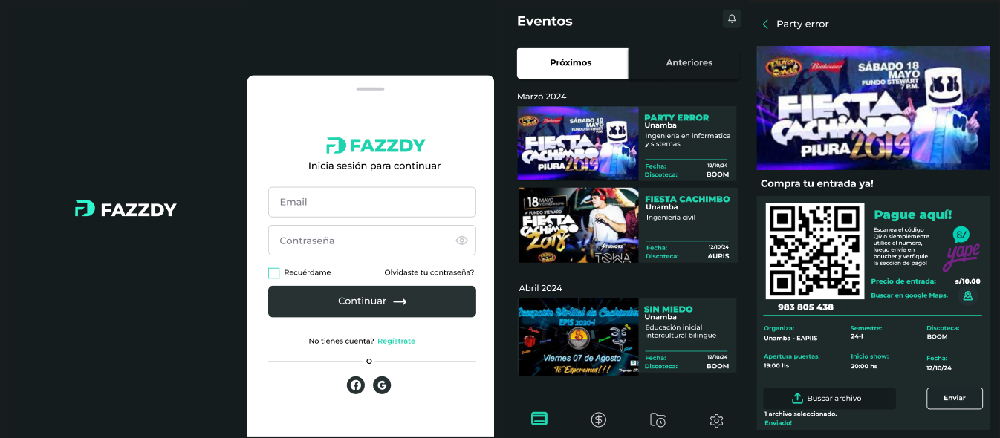

<div align="center">
    <a href="https://github.com/JheysonJhair/app_react-native_client_fazzdy">
      
    </a>
    <h1>JhairDev - Fazzdy</h1>
    <p align="center">
        Desarrollador Jhair
    </p>
</div>



# Fazzdy

Bienvenido a **Fazzdy**, una aplicación móvil desarrollada con React Native CLI, diseñada para notificar a los usuarios sobre cambios y eventos organizados por universidades. Con **Fazzdy**, podrás recibir alertas de eventos y comprar tus tickets de manera rápida y segura.

## Tecnologías Utilizadas

- **React Native CLI**: Biblioteca utilizada para el desarrollo de la interfaz de usuario.
- **JavaScript**: Lenguaje principal para la lógica de la aplicación.
- **CSS**: Estilización de componentes para una interfaz amigable y atractiva.

---

## Características de la Aplicación

- **Notificaciones en Tiempo Real**: Recibe alertas sobre cambios y nuevos eventos organizados por universidades.
- **Compra de Tickets**: Facilita la adquisición de tickets para los eventos.
- **Interfaz Intuitiva**: Diseño fácil de usar que permite una navegación fluida.

---

## Instalación

1. **Requisitos previos**:
   - Tener instalado **Node.js** y **npm** en tu sistema.
   - Tener configurado un entorno para React Native CLI. Consulta la [documentación oficial](https://reactnative.dev/docs/environment-setup) para más detalles.

2. **Clonar el repositorio**:
   ```bash
   git clone https://github.com/JheysonJhair/app_react-native_client_fazzdy.git
   cd app_react-native_client_fazzdy
   
2. **Instalar las dependencias**:
   ```bash
   npm install

2. **Ejecutar la aplicación**:
   ```bash
   npx react-native run-android
